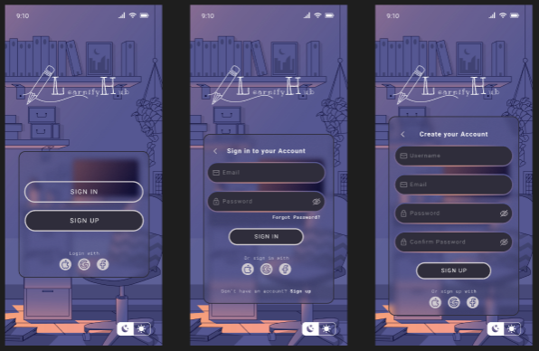
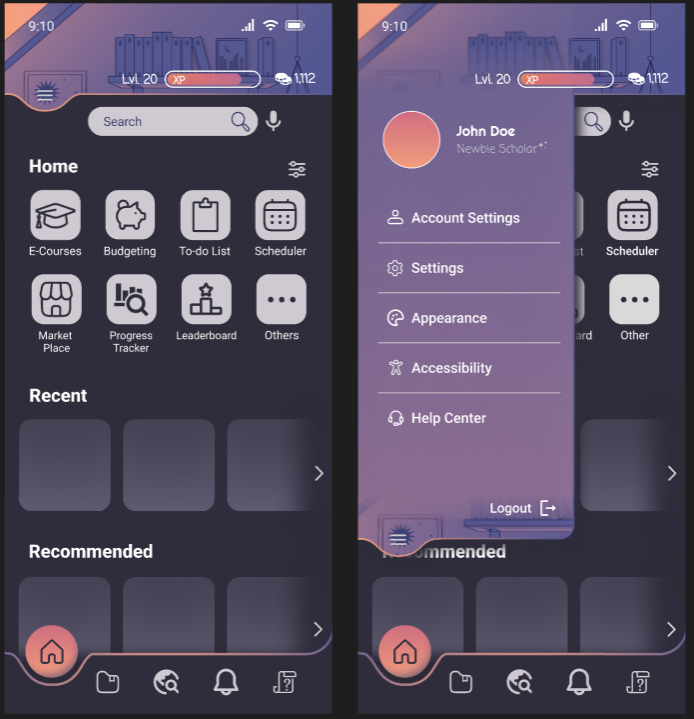
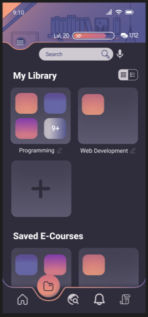
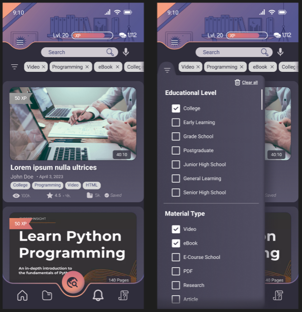
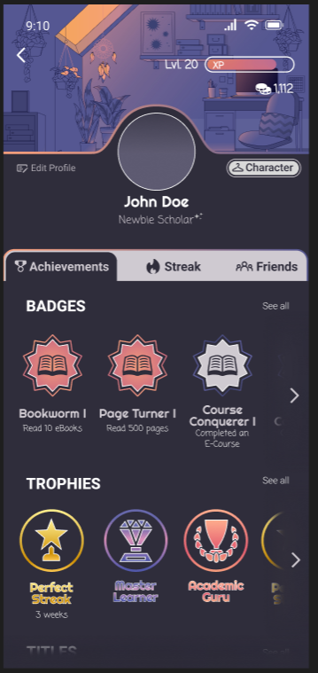
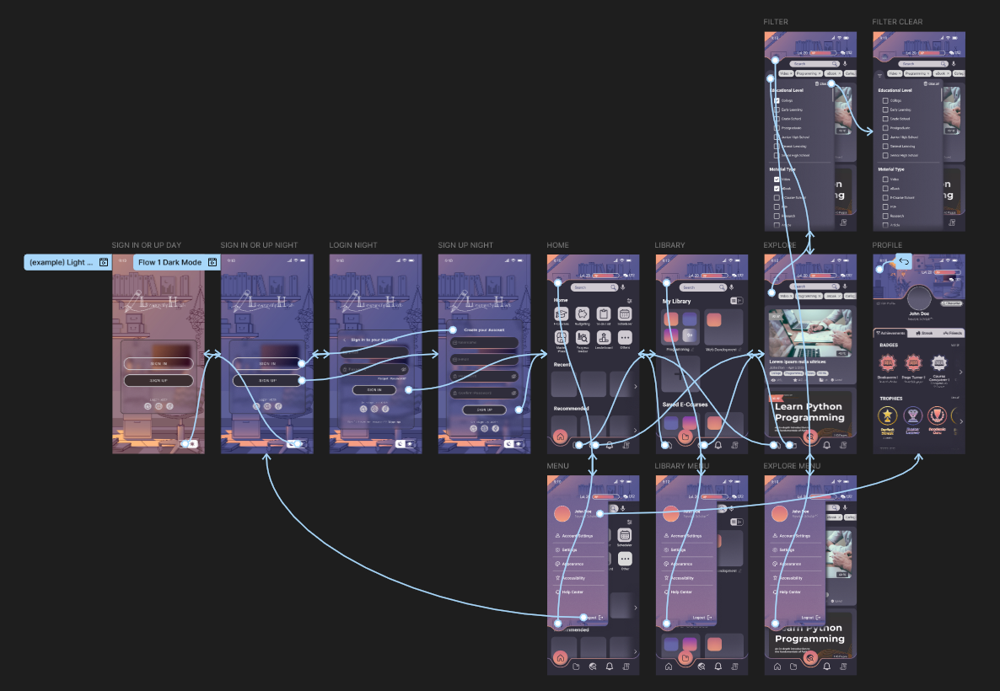
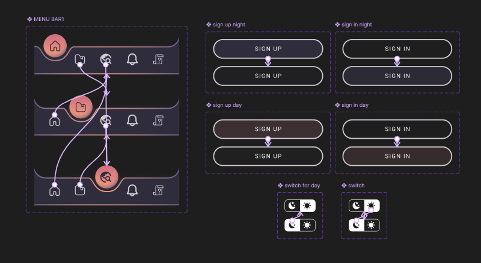

<h1 align="center"><b>🌟 LearnifyHub — Innovative Interactive Product 🌟</b>   <i>(Collaborative Work)</i></h1>

### 💫 Intro

A collaborative project from my <b>Human Computer Interaction</b> course, created using <b>Figma</b>. I designed the selected theme, layout, and UI for our interactive product named <b><i>"LearnifyHub"</i></b>. It is an interactive mobile application designed as a one-stop-shop platform for various study enrichment tools. While each member was tasked to create their own design proposal, the one I made was chosen and used as the final product. The Double Diamond Design Process was applied throughout the project.

 

⋆⋅☆⋅⋆ ───────────────────── ⋆⋅☆⋅⋆ ───────────────────── ⋆⋅☆⋅⋆

 

## 📖 Project Making Overview

This was our first ever project that focused on UI/UX design based on the app concept that my team discussed. It was also my first time using Figma to design a mobile application. During the process, I learned a lot about visual consistency, user-centered design process, prototyping, overall importance of designing, and other more through the experience.

## 📱 About the App

<b>LearnifyHub</b> is an interactive platform that is designed to be an easy to use mobile application with the goal of making a study app that is a one-stop-shop for all the study enrichment tools — such as videos, articles, eBooks, pdfs, and more – that a user could ever need to enhance the learners study experience.

The app concept is dedicated in ensuring its motivating learning environment and emphasizes usability and accessibility. Key features of the app includes:

- 🏆 A motivational "Level Up" and "Streak" ahievement system with badges, titles, and trophies
- 🧩 Smart filters (by educational level, material type, date, language, rating, etc) for quick access to relevant materials
- 📚 A wide variety of study resources — vidoes, eBooks, PDFs, e-courses, articles, and more
- 🧭 Easy navigation by a quick-access menu
- 📚 Customizable personal libraries for organizing saved resources

LearnifyHub focuses on providing learners with a diverse study tools catered to their needs, paired with a gamified "Level Up" achievement-based motivational model that rewards users for their growth and encourages continuous learning.

## 🍀 My Contributions
- 🖌️Designed the selected final UI layout
- 💡Helped brainstorm the concept and features of the app
- 🔮Focused on visual accessibility and layout consistency

## 🛠 Tool Used

## 🖼️ Screenshots

  <h3>📎 Light Mode and Dark Mode</h3>
  

 

  <h3>📎 Sign in and Sign up</h3>
  

 

  <h3>📎 Homepage/Landing Screen & Quick Menu</h3>
  

 

  <h3>📎 Custom Library & Saved Items</h3>
  

 

  <h3>📎 Explore Search System & Filtering</h3>
  

 

  <h3>📎 Profile and Achievements</h3>
  

 

  <h3>📎 UI Frames & Prototype Flow (Figma)</h3>
  

 

  <h3>📎 Components that were used</h3>
  

 

## 🎥 Prototype UI Preview
- [View here in Figma the Mockup App of LearnifyHub](https://www.figma.com/proto/a0bGdM2YoLcjbviRs3VzPs/LearnifyHub?node-id=18-5225&p=f&t=x61kHvXqNfclDgxy-1&scaling=min-zoom&content-scaling=fixed&page-id=11%3A69&show-proto-sidebar=1&starting-point-node-id=18%3A5285)

 

## 📌 Notes
> This is a course project made for academic purposes under the Human Computer Interaction course. 

> This was my first experience to ever use Figma and to design a mobile app, with only minimal knowledge of the tool.

  

⋆⋅☆⋅⋆ ───────── ⋆⋅☆⋅⋆ <b>END</b> ⋆⋅☆⋅⋆ ───────── ⋆⋅☆⋅⋆

 
