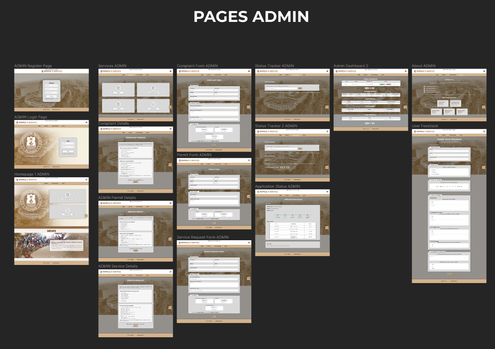

<h1 align="center"><b>🌟 E-Service Citizen Portal 🌟</b>   <i>(Collaborative Work)</i></h1>

### 💫 Intro

A collaborative project for both <b>Web Development</b> and <b>Human Computer Interaction</b> courses. It was built using <b>HTML</b>, <b>CSS</b>, <b>JavaScript</b>, <b>PHP</b>, and <b>MySQL</b> for the database, and designed in <b>Figma</b> for mockups and UI planning. This project is a website made for a local municipality or community, offering service request forms and a status tracker for submitted requests.

 

⋆⋅☆⋅⋆ ───────────────────── ⋆⋅☆⋅⋆ ───────────────────── ⋆⋅☆⋅⋆

 

## 📖 Project Overview

The <b>E-Service Citizen Portal</b> is a municipality focused website designed and developed to handle online services, such as permits, complaints, and request forms. The portal allows residents to fill out digital forms and monitor the status of their submissions in real time.

This is a team project for both Web Development and Human Computer Interaction courses. It focused on usability and accessibility, aiming to create an intuitive interface that could be easily navigated by the citizens — especially those who are not very familiar with technology, such as the elders.

## 🍀 My Contributions
#### 💻 Web Development:
- Assisted heavily with **CSS styling**, **overall visual design**, and **UI animations**
- Services Details Section  
- News & Announcements  
- About Page
- Header & Footer 
- FAQ
- Survey Feedback  

#### 🧠 Human-Computer Interaction:
- Finalized the Figma design  
- Created reusable components with interactive animations
- Built functional prototypes  
- Ensured layout consistency and enhanced overall user experience

## 🛠 Tool & Languages Used
      

## 🖼️ Screenshots

### 💻 My Part in Web Development (HTML Website)

  <h3>📎 Service Complaint Details</h3>
  
  
This page shows the serivce complaint information, including the requirements and instructions that must be reviewed before proceeding to the form.

 

  <h3>📎 Service Permit Details</h3>
  

  
This page displays information for the serivce permit information, including the required documents and steps users need to review before submitting the form.

 

  <h3>📎 Service Request Details</h3>
  
  
This page shows the serivce request details such as the requirements and instructions that guides the user before continuing to the form.

 

  <h3>📎 News and Announcements</h3>
  
   
  
  
🎥A short demo showing the toggle feature in the News & Announcements section and FAQ

 

 
  

  <h3>📎 About Page</h3>
  
  
This page contains the contact details for support and a list of the team members who contributed to its development.

 

  <h3>📎 Header and Footer</h3>
  
  

 

  <h3>📎 FAQ (Frequently Asked Questions) Toggle</h3>
  

 

  <h3>📎 Survey Feedback</h3>
  
  
This section allows users to provide feedback by filling out the survey form regarding their experience using the website and its services.

  

⋆⋅☆⋅⋆ ──────────────── ⋆⋅☆⋅⋆ ──────────────── ⋆⋅☆⋅⋆

 

### 🧠 Human-Computer Interaction (UI Frames in Figma)

  <h3>📎 Admin POV Frames</h3>
  
  
These are the UI frames of the admin POV in the system created in Figma

 

  <h3>📎 User POV Frames</h3>
  
  
These are the UI frames of the user POV in the system created in Figma

 

  <h3>📎 Popups and Components</h3>
  
  
These are the popup frames and components that were used

 

## 🎥 Prototype UI Preview
- [View here in Figma the Mockup of E-Service Citizen Portal](https://www.figma.com/proto/FGKGYBLfnJtzbciJ7JICRg/E-Services-Citizen-Portal--For-Portfolio-?node-id=1082-3517&t=U7XwkIfRMeXhvfzm-1&scaling=scale-down&content-scaling=fixed&page-id=816%3A497&starting-point-node-id=1157%3A18524&show-proto-sidebar=1)

 

## 📌 Notes
> This is a course project made for academic purposes under the Web Development and Human Computer Interaction course. 

> This is our second project with the use of the tool Figma. I already had the basic knowledge of the tool, which helped me understand its features better, though I still need to practice more to improve even better.

  

⋆⋅☆⋅⋆ ───────── ⋆⋅☆⋅⋆ <b>END</b> ⋆⋅☆⋅⋆ ───────── ⋆⋅☆⋅⋆

 
